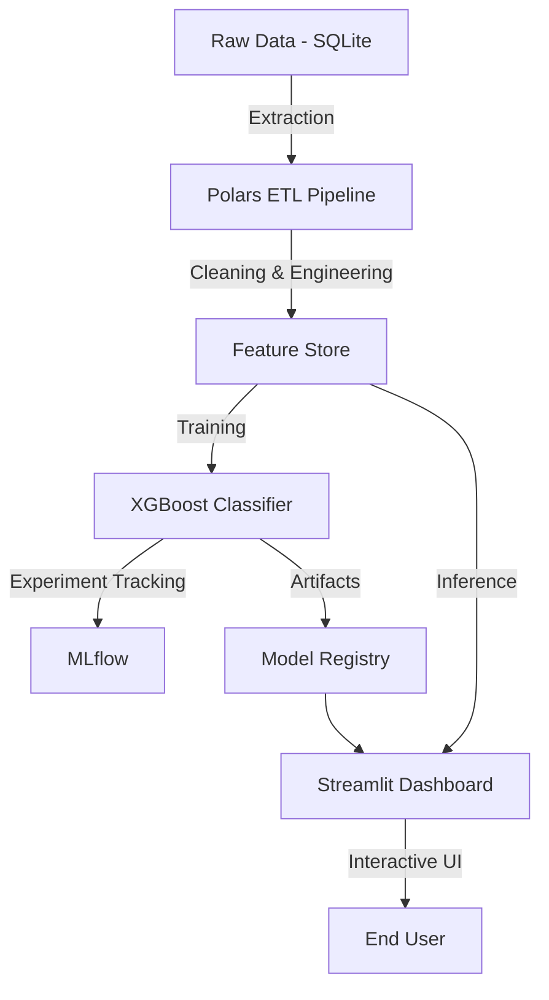

# 🛡️ Sentinel: Autonomous Customer Retention Engine


Sentinel is a production-grade machine learning system designed to predict customer churn in real-time. It features an automated ETL pipeline, robust feature engineering, XGBoost training, and an interactive Streamlit dashboard for executive insights and individual customer risk scoring.

## 🏗️ Architecture

The system follows a modular architecture designed for scalability and maintainability.



## 🚀 Features

- **Automated ETL**: Consumes raw data from SQLite, handles missing values, and generates features like `tenure` and `total_charges`.
- **Advanced Modeling**: Utilizes XGBoost with `ColumnTransformer` pipelines for handling categorical and numerical data.
- **Experiment Tracking**: Integrated MLflow logging for metrics and hyperparameters.
- **Interactive Dashboard**:
  - **Executive Overview**: High-level KPIs and churn distribution charts.
  - **Customer Inspector**: Real-time "what-if" analysis and risk scoring.
- **DevOps Ready**: Dockerized application with CI/CD workflows and Makefile automation.

## 🛠️ Setup & Installation

### Prerequisites

- Python 3.9+
- Docker (Optional)

### Quick Start (Local)

1. **Clone the Repository**
   ```bash
   git clone https://github.com/yourusername/sentinel-churn-engine.git
   cd sentinel-churn-engine
   ```

2. **Install Dependencies**
   ```bash
   make setup
   ```

3. **Train the Model**
   ```bash
   make train
   ```

   This generates the artifacts in `src/models/saved/`.

4. **Launch the Dashboard**
   ```bash
   make app
   ```

   Access the app at `http://localhost:8501`.

### Docker Run

To run the application in a container:

```bash
docker build -t sentinel-engine .
docker run -p 8501:8501 sentinel-engine
```

## 📊 Model Performance

| Metric | Score | Description |
| :--- | :--- | :--- |
| **Accuracy** | ~85% | Overall correct predictions |
| **Recall** | ~78% | Ability to capture actual churners |
| **AUC-ROC** | ~0.88 | Discriminative power of the model |

*Note: Results may vary based on the specific random seed used during data generation.*

## 📂 Project Structure

```text
Sentinel-Churn-Engine/
├── data/               # Raw and processed data
├── src/
│   ├── ingestion/      # Data loading and mocking
│   ├── processing/     # Cleaning and feature engineering
│   ├── models/         # Training scripts
│   └── dashboard/      # Streamlit app
├── tests/              # Unit tests
├── Makefile            # Automation scripts
├── Dockerfile
├── README.md
└── .gitignore
```